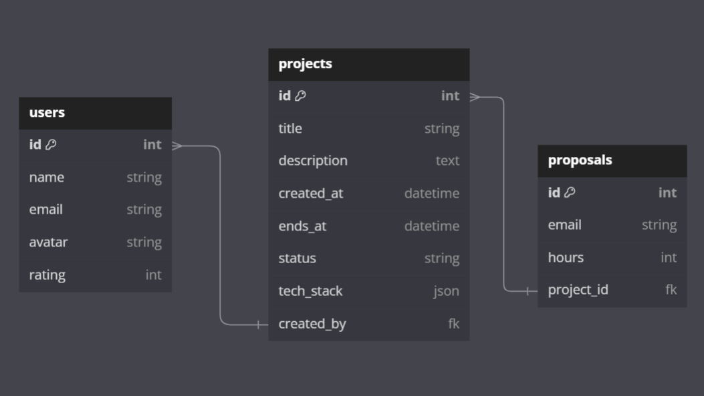

# FreelanceHours

A PHP project using Laravel.

## Schema



<details>
<summary>
Open to see <a href="dbdiagram.io">dbdiagram.io</a> script
</summary>

```
Table users {
  id int [primary key, increment]
  name string
  email string
  avatar string
  rating int
}

Table projects {
  id int [primary key, increment]
  title string
  description text
  created_at datetime
  ends_at datetime
  status string
  tech_stack json
  created_by fk [ref: < users.id]
}

Table proposals {
  id int [primary key, increment]
  email string
  hours int
  project_id fk [ref: < projects.id]
}
```

</details>

## Important commands

1. To create a new model: `php artisan make:model`

2. To drop all tables and recreate migrations: `php artisan migrate:fresh`

3. To seed database: `php artisan db:seed`

4. To do steps 2 and 3 at the same time: `php artisan migrate:fresh --seed`
